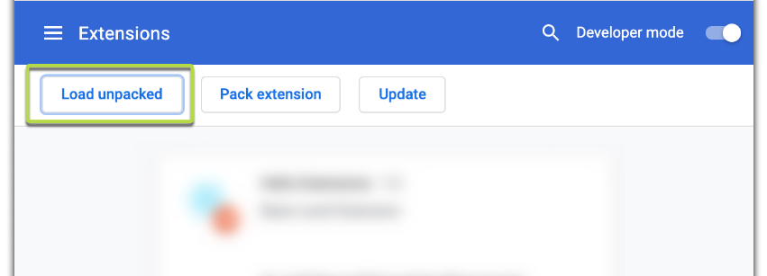

## Reference
https://github.com/nemrosim/chrome-react-extension-example
https://github.com/mozilla/jestr-pioneer-shield-study

## 1. How to build this extension:

```
$ npm run build
```

## 3. How to add it to your Chrome browser:



Select `/build` folder

## 4. How to run the react app
$ npm run start

## References
https://github.com/mozilla/OpenWPM/tree/master/openwpm/Extension/firefox
https://github.com/OpenMined/syft.js/blob/dev/examples/multi-armed-bandit


